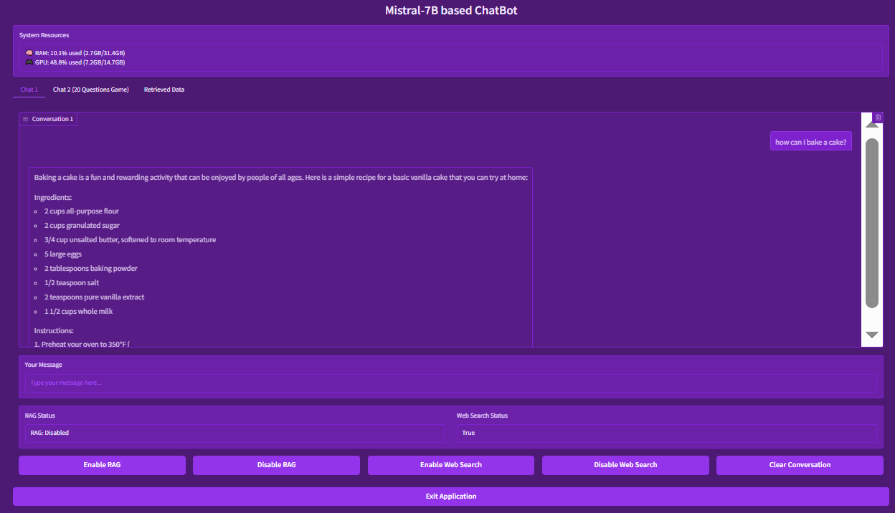
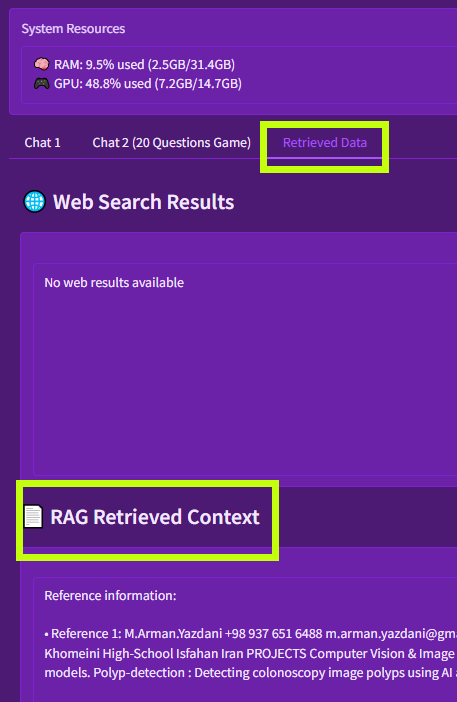
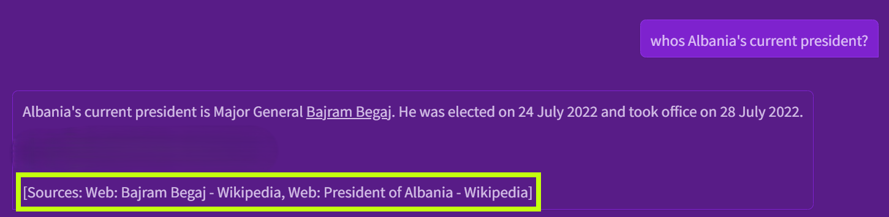
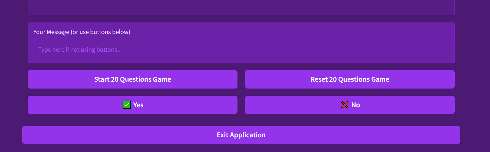
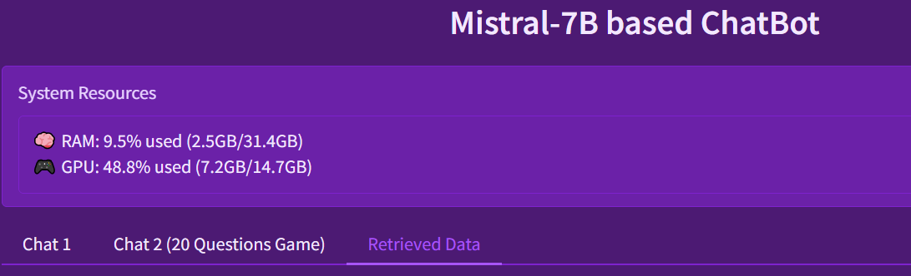

# ChatBot 
Our goal here is to design and implement a conversational chatbot based on a Large 
Language Model (LLM) with the ability to preserve and utilize conversation history. Unlike a 
simple chatbot that only responds to the most recent input, our system maintains awareness of the 
entire dialogue context, enabling it to provide more coherent, context-aware, and human-like 
responses. This feature is crucial in creating natural and intelligent interactions where users may 
refer to earlier parts of the conversation.  
*Find detailed explanations of any of the sections in notebook*

    
    <figcaption> 7B-size chatbot </figcaption>

## Context aware chat
- Initialization → Loads model and tokenizer. 
- User Input → Reads message from console. 
- History Update → Maintains all previous exchanges in conversation_history. 
- Context Management → Before generating, the history may be trimmed using manage_context_window. 
- Input Preparation → Combines history + current user input into tokenized format. 
- Response Generation → Calls the model to produce a reply. 
- Decoding → Converts raw tokens to human-readable response. 
- Display + Save → Prints the bot reply and updates history for the next turn.
## Retrieval-Augmented Generation (RAG) 

    
    <figcaption> Retrieved data from user's pdf </figcaption>

- RAG System Initialization
    - initialize rag if possible
    - if PDF exists at PDF PATH then
      - Extract text using 
      - Split into chunks
      - Initialize embedding model
      - Generate embeddings and normalize
      - Create FAISS index 
      - Add embeddings to index
      - Set rag enabled 

-  Information Retrieval Process
    - if rag enabled AND index exists AND chunks not empty then
      - Encode query
      - Search index
      - Format results with reference numbering
      - Return formatted system message
## WebIntegration 

    
    <figcaption> Web search sample </figcaption>

- Preserve original user input for display
- if web search enabled AND needed then
  - search results= searchexa(user input)
  - Update data_state.webdata
## Interactive Game

    
    <figcaption> 20Q game view </figcaption>

- Initialization 
  - Import ValidatorModel. 
  - Instantiate validator_model = ValidatorModel(). 
- Game Start 
  - Prompt the user (or system input) to confirm that the user intends to play. 
- Questioning Phase  
  - Generate a yes/no question about the secret word (e.g., "Is this an animal?"). 
  - Submit the question: validator_model.validate_question(question). 
  - Store the response. 
- Guessing Phase 
  - Use accumulated answers to form a hypothesis about the secret word. 
  - Submit the guess: validator_model.validate_guess(guess). 
  - If correct, terminate with success. 
- Termination 
  - If the model cannot guess correctly within 20 questions, terminate and mark as unsuccessful. 
## User Interface with Gradio
The interface implements a multi-tab architecture with sophisticated state management and real-time monitoring.

    
    <figcaption> Tabs and resources </figcaption>

